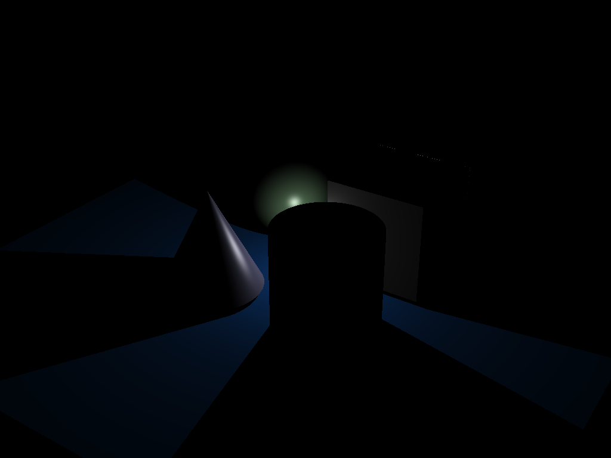
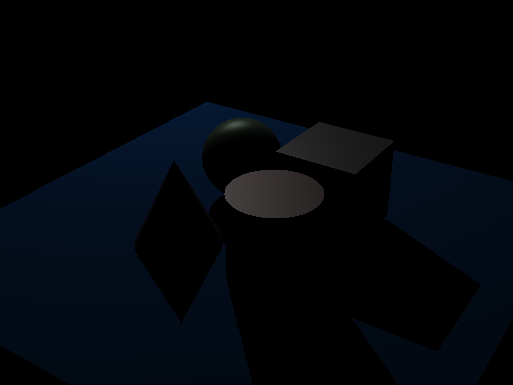
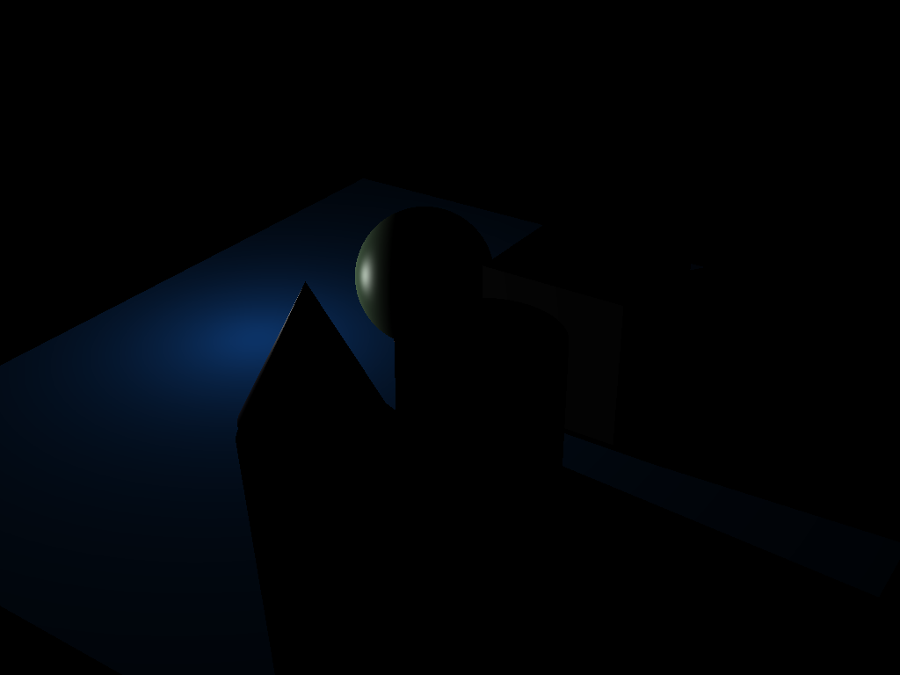

# **Black Box Optimization for Primitives & Lights in Ray Tracers**

This project explores the optimization of primitive objects and light sources in ray tracers using black-box methods. The aim is to iteratively minimize the error between a rendered image and a ground truth image.

---

## **Overview**
Ray tracing is a rendering technique that simulates the interaction of light with objects in 3D space. In this project, a black-box optimizer is applied to adjust the parameters of primitives (e.g., spheres, planes) and light sources to match a provided ground truth image.

---

## **Ground Truth**
The target image for optimization is shown below:

---

## **Optimization Process**
The optimization process dynamically adjusts parameters to minimize the difference between the rendered output and the ground truth. Below is a visualization of the process:

---

## **Result**
The final optimized rendering is displayed below:

---

